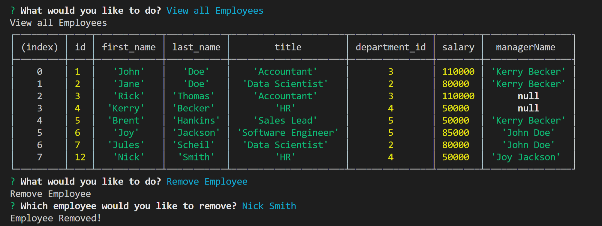

# Employee-Tracker
This CLI application allows a user to enter an employee database and create, read, update, and delete elements of the tables through Node.js 

Here is a video of its functionality: [Video Here](https://drive.google.com/file/d/1WskXD2vCtebZ9x3HJFZ1dfcN_ihhtsPU/view)

Here is what the application looks like: 

